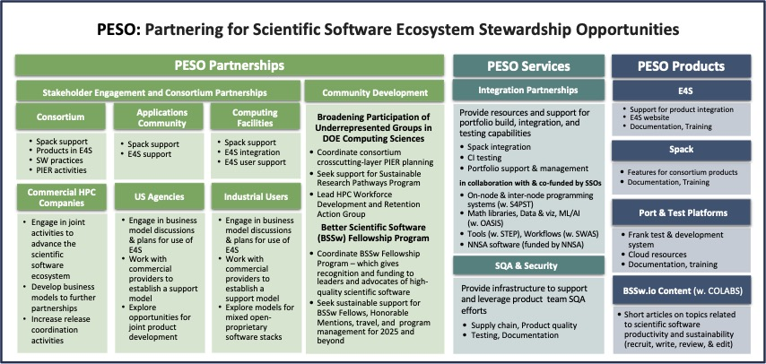
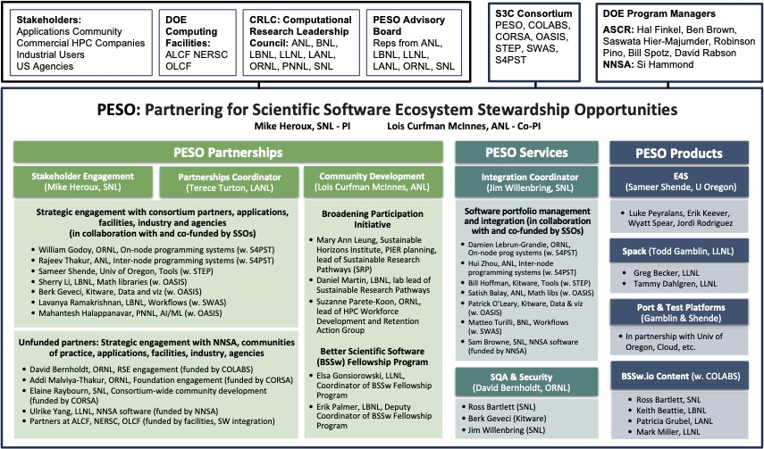

## PESO Organization

 
The PESO Project will focus on three thrust areas: **Partnerships**, **Services**, and **Products**. In each thrust area, we will engage with other ecosystem members to ensure our efforts address the highest priority needs and provide effective and efficient solutions that can be leveraged across multiple members.

 
The PESO team includes members who represent each of the other S3C consortium member teams, helping to ensure that PESO addresses S3C member needs both strategically and technically.