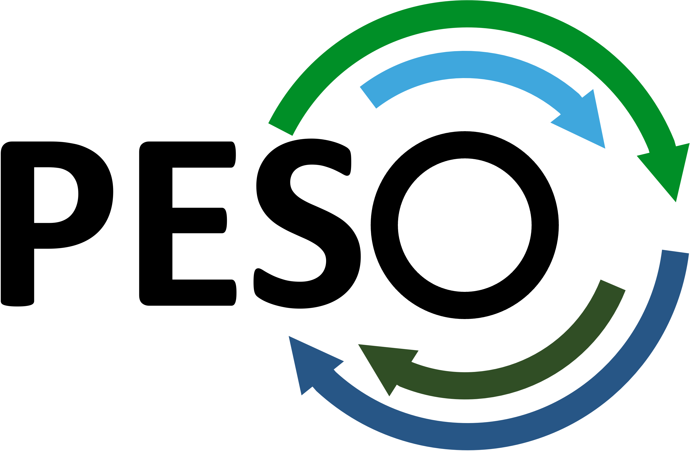

## PESO: Toward a Post-ECP Software-Sustainability Organization

### PESO Overview
The PESO Project seeks to establish robust and sustainable scientific software capabilities aligned with the interests of the Department of Energy Office (DOE) of Advanced Scientific Computing Research (ASCR) via partnerships with software teams and communities within DOE, other US agencies, commercial scientific software developers, and the broader open source software community. In partnership with these teams and communities, we intend to engage with the scientific computing stakeholders, including DOE computing facilities, hardware and software vendors, other software organizations, US agencies, and industrial and international institutions.  The goal of these engagements is to advance scientific pursuits by providing advanced scientific libraries and tools to the user community in ways that optimize the cost and benefit sharing of DOE's investments in scientific libraries and tools.

### PESO Vision

The US DOE sponsors significant investments in reusable scientific libraries and tools that address the critical and emerging requirements for scientific applications that support the DOE mission.  PESO seeks to optimize the impact of DOE investments by engaging with developers, collaborators, users, and stakeholders of DOE-sponsored software efforts.  PESO will engage with software teams by providing resources that help them improve the quality of their work, and improve user access and experience. We will also facilitate the engagement of software teams with their stakeholders to better assure the alignment of requirements.  Through PESO infrastructure and activity investments, we will provide a curated portfolio of high-quality scientific libraries and tools.  This portfolio will enable accelerated scientific advances for applications that can depend upon the capabilities we provide.

### More about PESO
- [Science Impact and PESO: PESO Overview, Q&A, June 20, 2023, 3 - 4:30 pm ET](PESO/PESOMeeting1.md)
 - [Spoke Projects Information](SeedProjects.md)
- [FAQs](FAQ.md)
- [Summary of Past and Upcoming Meetings](PESOTownHalls.md)
- [PESO Collaboration Strategy](PESOCollaboration.md)
- [Contribute to PESO Efforts](PESOContribute.md)
- [PESO Leadership Team](PESOTeam.md)

## Previous meetings
- [Content from the PESO June 8 - 9, 2023 Argonne Workshop](Meetings/ResourcesWorkshop1/Workshop1.md)
- [Slides and video from PESO Town Hall Meetings](PESOTownHalls.md).  
 
## Resources
As part of PESO efforts, we ask the community to make contributions to this website:
- **[White Papers:](WhitePapers/WhitePaperList.md)** Contributed written content to PESO conversations. We encourage you to write a 2 - 4 page white paper and submit it to the LLSw website via a [pull request to the White Papers page](WhitePapers/WhitePaperList.md).
- **[References:](References/ReferenceList.md)** Relevant published content to inform the PESO community. Please add a reference to the PESO website via a [pull request to the References page](References/ReferenceList.md).
- **[Town Hall Archives:](TownHallArchives/TownHallArchiveList.md)** Slides and recordings from previous town hall meetings.
